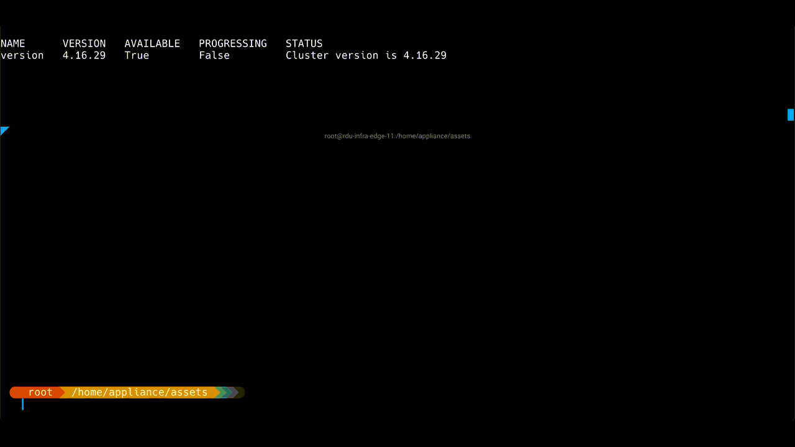

# OpenShift Appliance User Guide

## What is OpenShift Appliance
The `openshift-appliance` utility enables self-contained OpenShift cluster installations, meaning that it does not rely on Internet connectivity or external registries.
It is a container-based utility that builds a disk image that includes the [Agent-based installer](https://cloud.redhat.com/blog/meet-the-new-agent-based-openshift-installer-1).
That disk image can then be used to install multiple OpenShift clusters.

## Download
OpenShift Appliance is available for download at: https://quay.io/edge-infrastructure/openshift-appliance

## High-Level Flow Overview


### Lab
* This is where `openshift-appliance` gets used to create a raw sparse disk image.
  * **raw:** so it can be copied as-is to multiple servers.
  * **sparse:** to minimize the physical size.
* The end result is a generic disk image with a partition layout as follows:
  ``` bash
  Name       Type        VFS      Label       Size  Parent
  /dev/sda2  filesystem  vfat     EFI-SYSTEM  127M  -
  /dev/sda3  filesystem  ext4     boot        350M  -
  /dev/sda4  filesystem  xfs      root        180G  -
  /dev/sda5  filesystem  ext4     agentboot   1.2G  -
  /dev/sda6  filesystem  iso9660  agentdata   18G   -
  ```
* The two additional partitions:
  * `agentboot`: Agent-based installer ISO:
    * Allows a first boot.
    * Used as a recovery / re-install partition (with an added GRUB menu entry).
  * `agentdata`: OCP release images payload.
* Note that sizes may change, depending on the configured `diskSizeGB` and the selected OpenShift version configured in `appliance-config.yaml` (described below).

### Factory
* This is where the disk image is written to the disk using tools such as `dd`.
* As mentioned above, the image is generic. Thus, the same image can be used on multiple servers for multiple clusters, assuming they have the same disk size.

### User site
* This is where the cluster will be deployed.
* The user boots the machine and mounts the configuration ISO (cluster configuration).
* The OpenShift installation will run until completion.

## Disk Image Build - Lab

### Set Environment

**:warning: Use absolute directory paths.**
  ```shell
  export APPLIANCE_IMAGE="quay.io/edge-infrastructure/openshift-appliance"
  export APPLIANCE_ASSETS="/home/test/appliance_assets"
  ```

### Generate a template of the appliance config
A configuration file named `appliance-config.yaml` is required for running `openshift-appliance`.
  ```shell
  podman run --rm -it --pull newer -v $APPLIANCE_ASSETS:/assets:Z $APPLIANCE_IMAGE generate-config
  ```
Result:
```shell
INFO Generated config file in assets directory: appliance-config.yaml
```

### Set `appliance-config`
* Initially, the template will include comments about each option and will look as follows:
* Check the [appliance-config](./appliance-config.md) details on how to set each parameter.

```yaml
#
# Note: This is a sample ApplianceConfig file showing
# which fields are available to aid you in creating your
# own appliance-config.yaml file.
#
apiVersion: v1beta1
kind: ApplianceConfig
ocpRelease:
  # OCP release version in major.minor or major.minor.patch format
  # (in case of major.minor - latest patch version will be used)
  # If the specified version is not yet available, the latest supported version will be used.
  version: ocp-release-version
  # OCP release update channel: stable|fast|eus|candidate
  # Default: stable
  # [Optional]
  channel: ocp-release-channel
  # OCP release CPU architecture: x86_64|aarch64|ppc64le
  # Default: x86_64
  # [Optional]
  cpuArchitecture: cpu-architecture
# Virtual size of the appliance disk image.
# If specified, should be at least 150GiB.
# If not specified, the disk image should be resized when
# cloning to a device (e.g. using virt-resize tool).
# [Optional]
diskSizeGB: disk-size
# PullSecret is required for mirroring the OCP release payload
# Can be obtained from: https://console.redhat.com/openshift/install/pull-secret
pullSecret: pull-secret
# Public SSH key for accessing the appliance during the bootstrap phase
# [Optional]
sshKey: ssh-key
# Password of user 'core' for connecting from console
# [Optional]
userCorePass: user-core-pass
# Local image registry details (used when building the appliance)
# Note: building an image internally by default.
# [Optional]
imageRegistry:
  # The URI for the image
  # Default: ""
  # Examples: 
  # - docker.io/library/registry:2
  # - quay.io/libpod/registry:2.8
  # [Optional]
  uri: uri
  # The image registry container TCP port to bind. A valid port number is between 1024 and 65535.
  # Default: 5005
  # [Optional]
  port: port
# Enable all default CatalogSources (on openshift-marketplace namespace).
# Should be disabled for disconnected environments.
# Default: false
# [Optional]
enableDefaultSources: enable-default-sources
# Stop the local registry post cluster installation.
# Note that additional images and operators won't be available when stopped.
# Default: false
# [Optional]
stopLocalRegistry: stop-local-registry
# Create PinnedImageSets for both the master and worker MCPs.
# The PinnedImageSets will include all the images included in the appliance disk image.
# Requires openshift version 4.16 or above.
# WARNING: 
# As of 4.18, PinnedImageSets feature is still not GA.
# Thus, enabling it will set the cluster to tech preview,
# which means the cluster cannot be upgraded
# (i.e. should only be used for testing purposes).
# Default: false
# [Optional]
createPinnedImageSets: create-pinned-image-sets
# Enable FIPS mode for the cluster.
# Note: 'fips' should be enabled also in install-config.yaml.
# Default: false
# [Optional]
enableFips: enable-fips
# Enable the interactive installation flow.
# Should be enabled to provide cluster configuration through the web UI
# (i.e. instead of using a config-image).
# Default: false
# [Optional]
enableInteractiveFlow: enable-interactive-flow
# Additional images to be included in the appliance disk image.
# [Optional]
additionalImages:
   - name: image-url
# Operators to be included in the appliance disk image.
# See examples in https://github.com/openshift/oc-mirror/blob/main/docs/imageset-config-ref.yaml.
# [Optional]
operators:
  - catalog: catalog-uri
    packages:
      - name: package-name
        channels:
          - name: channel-name
```
* Modify it based on your needs. Note that:
  * `diskSizeGB`: Must be set according to the actual server disk size. If you have several server specs, you need an appliance image per each spec.
  * `ocpRelease.channel`: OCP release [update channel](https://access.redhat.com/documentation/en-us/openshift_container_platform/4.13/html/updating_clusters/understanding-upgrade-channels-releases#understanding-upgrade-channels_understanding-upgrade-channels-releases) (stable|fast|eus|candidate)
  * `pullSecret`: May be obtained from https://console.redhat.com/openshift/install/pull-secret (requires registration).
  * `imageRegistry.uri`: Change it only if needed, otherwise the default should work.
  * `imageRegistry.port`: Change the port number in case another app uses TCP 5005.
#### `appliance-config.yaml` Example:
```yaml
apiVersion: v1beta1
kind: ApplianceConfig
ocpRelease:
  version: 4.14
  channel: candidate
  cpuArchitecture: x86_64
diskSizeGB: 200
pullSecret: '{"auths":{<redacted>}}'
sshKey: <redacted>
userCorePass: <redacted>
```

### Add custom manifests (Optional)
* Note that any manifest added here will apply to **any** of the clusters installed using this image.
* Find more details and additional examples in OpenShift documentation:
  * [Customizing nodes](https://docs.openshift.com/container-platform/4.13/installing/install_config/installing-customizing.html)
  * [Using MachineConfig objects to configure nodes](https://docs.openshift.com/container-platform/4.13/post_installation_configuration/machine-configuration-tasks.html#using-machineconfigs-to-change-machines)

1. Create the openshift manifests directory
```shell
mkdir ${APPLIANCE_ASSETS}/openshift
```

2. Add one or more custom manifests under `${APPLIANCE_ASSETS}/openshift`.
#### MachineConfig example:
```yaml
apiVersion: machineconfiguration.openshift.io/v1
kind: MachineConfig
metadata:
  labels:
    machineconfiguration.openshift.io/role: master
  name: 50-master-custom-file-factory
spec:
  config:
    ignition:
      version: 3.2.0
    storage:
      files:
        - contents:
            source: data:text/plain;charset=utf-8;base64,dGhpcyBjb250ZW50IGNhbWUgZnJvbSBidWlsZGluZyB0aGUgYXBwbGlhbmNlIGltYWdlCg==
          mode: 420
          path: /etc/custom_factory1.txt
          overwrite: true
```

### Include additional images (Optional)

Add any additional images that should be included as part of the appliance disk image.
These images will be pulled during the oc-mirror procedure that downloads the release images.

E.g. Use the `additionalImages` array in `appliance-config.yaml` as follows:
```shell
additionalImages:
  - name: quay.io/fedora/httpd-24
  - name: quay.io/openshift/origin-cli
```

After installing the cluster, images should be available for pulling using the image digest.
To fetch the digest, use skopeo from inside the node.
E.g.
```shell
skopeo inspect docker://registry.appliance.com:5000/fedora/httpd-24 | jq .Digest
"sha256:5d98ffbb97ea86633aed7ae2445b9d939e29639a292d3052efb078e72606ba04"
```
```shell
podman pull quay.io/fedora/httpd-24@sha256:5d98ffbb97ea86633aed7ae2445b9d939e29639a292d3052efb078e72606ba04
```

The image can be used, for example, to create a new application:
```shell
oc --kubeconfig auth/kubeconfig new-app --name httpd --image quay.io/fedora/httpd-24@sha256:5d98ffbb97ea86633aed7ae2445b9d939e29639a292d3052efb078e72606ba04 --allow-missing-images
```
```shell
oc --kubeconfig auth/kubeconfig get deployment
NAME    READY   UP-TO-DATE   AVAILABLE
httpd   1/1     1            1
```

### Include and install operators (Optional)

#### Include operators in the appliance

Operators packages can be included in the appliance disk image using the `operators` property in `appliance-config.yaml`. The relevant images will be pulled during the oc-mirror procedure, and the appropriate CatalogSources and ImageContentSourcePolicies will be automatically created in the installed cluster.

E.g. To include the `elasticsearch-operator` from `redhat-operators` catalog:
```yaml
operators:
  - catalog: registry.redhat.io/redhat/redhat-operator-index:v4.14
    packages:
      - name: elasticsearch-operator
        channels:
          - name: stable-5.8
```

Note: for each operator, ensure the name and channel are correct by listing the available operators in catalog:
```bash
oc-mirror list operators --catalog=registry.redhat.io/redhat/redhat-operator-index:v4.14
```

#### Install operators in cluster

To automatically install the included operators during cluster installation, add the relevant custom manifests to `${APPLIANCE_ASSETS}/openshift`.

Note: these manifests will deploy the operators for any cluster installation. I.e. the manifests will be incorporated in the appliance disk image.

E.g. Cluster manifests to install OpenShift Elasticsearch Operator:

*openshift/namespace.yaml*
```yaml
apiVersion: v1
kind: Namespace
metadata:
  name: operators
  labels:
    name: operators
```

*openshift/operatorgroup.yaml*
```yaml
apiVersion: operators.coreos.com/v1
kind: OperatorGroup
metadata:
  name: operator-group
  namespace: operators
spec:
  targetNamespaces:
  - operators
```

*openshift/subscription.yaml*
```yaml
apiVersion: operators.coreos.com/v1alpha1
kind: Subscription
metadata:
  name: elasticsearch
  namespace: operators
spec:
  installPlanApproval: Automatic
  name: elasticsearch-operator
  source: cs-redhat-operator-index
  channel: stable
  sourceNamespace: openshift-marketplace
```

Note: each file should contain a single object.

### Build the disk image
* Make sure you have enough free disk space.
  * The amount of space needed is defined by the configured `diskSizeGB` value mentioned above, which is at least 150GiB.
* Building the image may take several minutes.
* The option `--privileged` is used because the `openshift-appliance` container needs to use `guestfish` to build the image.
* The option `--net=host` is used because the `openshift-appliance` container needs to use the host networking for the image registry container it runs as a part of the build process.
```shell
sudo podman run --rm -it --pull newer --privileged --net=host -v $APPLIANCE_ASSETS:/assets:Z $APPLIANCE_IMAGE build
```

Result
```shell
INFO Successfully downloaded CoreOS ISO
INFO Successfully generated recovery CoreOS ISO
INFO Successfully pulled container registry image
INFO Successfully pulled OpenShift 4.14.0-rc.0 release images required for bootstrap
INFO Successfully pulled OpenShift 4.14.0-rc.0 release images required for installation
INFO Successfully generated data ISO
INFO Successfully downloaded appliance base disk image
INFO Successfully extracted appliance base disk image
INFO Successfully generated appliance disk image
INFO Time elapsed: 8m0s
INFO
INFO Appliance disk image was successfully created in assets directory: assets/appliance.raw
INFO
INFO Create configuration ISO using: openshift-install agent create config-image
INFO Download openshift-install from: https://mirror.openshift.com/pub/openshift-v4/x86_64/clients/ocp/4.14.0-rc.0/openshift-install-linux.tar.gz
```

### Rebuild

Before rebuilding the appliance, e.g. for changing `diskSizeGB` or `ocpRelease`, use the `clean` command. This command removes the temp folder and prepares the `assets` folder for a rebuild.
```shell
sudo podman run --rm -it -v $APPLIANCE_ASSETS:/assets:Z $APPLIANCE_IMAGE clean
```

Note: the command keeps the `cache` folder under `assets` intact, use the `--cache` flag to clean the entire cache as well.
```shell
sudo podman run --rm -it -v $APPLIANCE_ASSETS:/assets:Z $APPLIANCE_IMAGE clean --cache
```

#### Demo
[](https://asciinema.org/a/591871)

## Clone appliance disk image to a device (Factory)

### Baremetal servers

#### Clone disk image as-is (when 'diskSizeGB' is specified in appliance-config)
Use a tool like `dd` to clone the disk image.
E.g.
```shell
dd if=appliance.raw of=/dev/sdX bs=1M status=progress
```
This will clone the appliance disk image onto sdX. To initiate the cluster installation, boot the machine from the sdX device.

#### Resize and clone disk image (when 'diskSizeGB' is not specified in appliance-config)
Use virt-resize tool to resize and clone the disk image.
E.g.
```shell
export APPLIANCE_IMAGE="quay.io/edge-infrastructure/openshift-appliance"
export APPLIANCE_ASSETS="/home/test/appliance_assets"
export TARGET_DEVICE="/dev/sda"
sudo podman run --rm -it --privileged --net=host -v $APPLIANCE_ASSETS:/assets --entrypoint virt-resize $APPLIANCE_IMAGE --expand /dev/sda4 /assets/appliance.raw $TARGET_DEVICE --no-sparse
```
This will resize and clone the disk image onto the specified `TARGET_DEVICE`. To initiate the cluster installation, boot the machine from the `TARGET_DEVICE`.

:warning: Note: if the target device is empty (zeroed) before cloning, the `--no-sparse` flag can be removed (which will improve the cloning speed).

#### Boot from deployment ISO

As an alternative to manually cloning the disk image, see [Deployment ISO](#deployment-iso) section for instructions to generate an ISO that automates the flow.

### Virtual machines
Configure the disk to use `/path/to/appliance.raw`

## OpenShift cluster installation (User Site)

### Download `openshift-install`
* So far, the generated image has been completely generic. To install the cluster, the installer will need cluster-specific configuration.
* In order to generate the configuration image using `openshift-install`, download the binary from the URL specified in build output.
E.g. for `4.14.0-rc.0`
https://mirror.openshift.com/pub/openshift-v4/x86_64/clients/ocp/4.14.0-rc.0/openshift-install-linux.tar.gz

### Generate a Cluster Configuration Image

#### Create config yamls

* Create a configuration directory

**:warning: Use absolute directory paths.**
  ```shell
  export CLUSTER_CONFIG=/home/test/cluster_config
  mkdir $CLUSTER_CONFIG && cd $CLUSTER_CONFIG
  ```
* Place both `install-config.yaml` and `agent-config.yaml` files in that directory.

Notes:
* See details and examples in the ABI documentation: [Installing an OpenShift Container Platform cluster with the Agent-based Installer](https://docs.openshift.com/container-platform/4.17/installing/installing_with_agent_based_installer/installing-with-agent-based-installer.html)
* For disconnected environments, specify a dummy pull-secret in install-config.yaml (e.g. `'{"auths":{"":{"auth":"dXNlcjpwYXNz"}}}'`).
* The SSH public key for `core` user can be specified in install-config.yaml under `sshKey` property. It can be used for logging into the machines post cluster installation.

##### Examples

###### Creating an SNO cluster

*agent-config.yaml*
```yaml
apiVersion: v1alpha1
kind: AgentConfig
rendezvousIP: 192.168.122.100
```

*install-config.yaml*
```yaml
apiVersion: v1
metadata:
  name: appliance
baseDomain: appliance.com
controlPlane:
  name: master
  replicas: 1
compute:
- name: worker
  replicas: 0
networking:
  networkType: OVNKubernetes
  machineNetwork:
  - cidr: 192.168.122.0/24
platform:
  none: {}
# Dummy pull-secret for disconnected environments
pullSecret: '{"auths":{"":{"auth":"dXNlcjpwYXNz"}}}'
# SSH public key for `core` user, can be used for logging into machine post cluster installation
sshKey: 'ssh-rsa ...'
```

###### Creating a multi-node cluster

*agent-config.yaml*
```yaml
apiVersion: v1alpha1
kind: AgentConfig
rendezvousIP: 192.168.122.100
```

*install-config.yaml*
```yaml
apiVersion: v1
metadata:
  name: appliance
baseDomain: appliance.com
controlPlane:
  name: master
  replicas: 3
compute:
- name: worker
  replicas: 2
networking:
  networkType: OVNKubernetes
  machineNetwork:
  - cidr: 192.168.122.0/24
platform:
  baremetal:
    apiVIPs:
    - 192.168.122.200
    ingressVIPs:
    - 192.168.122.201
# Dummy pull-secret for disconnected environments
pullSecret: '{"auths":{"":{"auth":"dXNlcjpwYXNz"}}}'
# SSH public key for `core` user, can be used for logging into machine post cluster installation
sshKey: 'ssh-rsa ...'
```

#### Add custom manifests (Optional)
* Note that any manifest added here will apply **only** to the cluster installed using this config-iso.
* Find more details and additional examples in OpenShift documentation:
  * [Customizing nodes](https://docs.openshift.com/container-platform/4.13/installing/install_config/installing-customizing.html)
  * [Using MachineConfig objects to configure nodes](https://docs.openshift.com/container-platform/4.13/post_installation_configuration/machine-configuration-tasks.html#using-machineconfigs-to-change-machines)
  * [Using ZTP manifests](https://docs.openshift.com/container-platform/4.13/installing/installing_with_agent_based_installer/installing-with-agent-based-installer.html#installing-ocp-agent-ztp_installing-with-agent-based-installer)
1. Create the openshift manifests directory
```shell
mkdir $CLUSTER_CONFIG/openshift
```

2. Add one or more custom manifests under `$CLUSTER_CONFIG/openshift`. Same as in [this MachineConfig example](user-guide.md#MachineConfig-example)

#### Install operators in cluster (Optional)

To automatically install operators during cluster installation, add the relevant custom manifests (see [example](#install-operators-in-cluster)) to `$CLUSTER_CONFIG/openshift`.

Note: for disconnected environment, the operators should be [included](#include-and-install-operators-optional) in the appliance.

#### Create the config-image

When ready, generate the config ISO.

  :warning: The following command will delete the `install-config.yaml` and `agent-config.yaml` files - back them up first.

  ```shell
  ./openshift-install agent create config-image --dir $CLUSTER_CONFIG
  ```

The content of `cluster_config` directory should be
  ```shell
  ├── agentconfig.noarch.iso
  ├── auth
  │   ├── kubeadmin-password
  │   └── kubeconfig
  ```

Note: The config ISO contains configurations and cannot be used as a bootable ISO.

### Mount
**:warning: Ensure nodes have sufficient vCPUs and memory, see [requirements](https://docs.openshift.com/container-platform/4.13/installing/installing_with_agent_based_installer/preparing-to-install-with-agent-based-installer.html#recommended-resources-for-topologies).**
* Mount the `agentconfig.noarch.iso` as a CD-ROM on every node, or attach it using a USB stick.
* Start the machine(s)

### Demo
[](https://asciinema.org/a/590824)

### Monitor installation
Use `openshift-install` to monitor the bootstrap and installation process

#### Monitor the bootstrap process
  ```shell
  ./openshift-install --dir $CLUSTER_CONFIG agent wait-for bootstrap-complete
  ```
* Review OpenShift documentation: [Waiting for the bootstrap process to complete](https://docs.openshift.com/container-platform/4.13/installing/installing_platform_agnostic/installing-platform-agnostic.html#installation-installing-bare-metal_installing-platform-agnostic)
#### Monitor the installation process
  ```shell
  ./openshift-install --dir $CLUSTER_CONFIG agent wait-for install-complete
  ```
* Review OpenShift documentation: [Completing installation on user-provisioned infrastructure](https://docs.openshift.com/container-platform/4.13/installing/installing_platform_agnostic/installing-platform-agnostic.html#installation-complete-user-infra_installing-platform-agnostic)

### Access Cluster

**:warning: Ensure the server domain in $CLUSTER_CONFIG/auth/kubeconfig is resolvable.**

```shell
export KUBECONFIG=$CLUSTER_CONFIG/auth/kubeconfig
```

#### Confirm that the cluster version is available:
```shell
oc get clusterverison
```

#### Confirm that all cluster components are available:
``` shell
oc get clusteroperator
```

### Recovery / Reinstall
* To reinstall the cluster using the above-mentioned `agentboot` partition, reboot all the nodes and select the `Recovery: Agent-Based Installer` option.


## Deployment ISO

To simplify the deployment process of the appliance disk image (appliance.raw), the deployment ISO can be used. Upon booting a machine with this ISO, the appliance disk image would be automatically cloned into the specified target device.

To build the ISO, appliance.raw disk image should be available under `assets` directory. I.e. the appliance disk image should be first built.

:warning: Note: the appliance.raw should be built without specifying `diskSizeGB` property in appliance-config.yaml

### Build

Use the 'build iso' command for generating the ISO:
```shell
export APPLIANCE_IMAGE="quay.io/edge-infrastructure/openshift-appliance"
export APPLIANCE_ASSETS="/home/test/appliance_assets"
sudo podman run --rm -it --privileged -v $APPLIANCE_ASSETS:/assets:Z $APPLIANCE_IMAGE build iso --target-device /dev/sda
```

The result should be an appliance.iso file under `assets` directory. To initiate the deployment, attach/mount the ISO to the machine and boot it. After the deployment is completed, boot from the target device to start cluster installation.


The command supports the following flags:
```
--target-device string    Target device name to clone the appliance into (default "/dev/sda")
--post-script string      Script file to invoke on completion (should be under assets directory)
--sparse-clone            Use sparse cloning - requires an empty (zeroed) device
--dry-run                 Skip appliance cloning (useful for getting the target device name)
```

### Examples

#### --post-script

To perform post deployment operations create a bash script file under assets directory.

E.g. shutting down the machine post deployment

```bash
cat $APPLIANCE_ASSETS/post.sh

#!/bin/bash
echo Shutting down the machine...
shutdown -a
```

```bash
sudo podman run --rm -it --privileged -v $APPLIANCE_ASSETS:/assets:Z $APPLIANCE_IMAGE build iso --post-script post.sh
```

### Demo


## Upgrade ISO

In order to upgrade a cluster without an external registry, the upgrade ISO flow can be used. An upgrade ISO includes the entire release payload of a specific OCP version, which allows upgrading clusters in disconnected environments.

The process for upgrading a cluster is as follows:
* Create an `appliance-config.yaml` file:
  * Set the requested version under `ocpRelease`.
  * Set `pullSecret`.
* Generate an ISO using `build upgrade-iso` command.
* Attach the ISO to each node in the cluster.
* To start the upgrade, apply the generated MachineConfig yaml.

**:warning: Limitations:**
* This process is currently experimental.
* After upgrading a cluster, the ISO should not be detached.
  * This is required to allow pulling images post-upgrade (might be needed, in some scenarios, for images missing from CRI-O containers-storage).
  * Will be resolved using [PinnedImageSet](https://github.com/openshift/enhancements/blob/master/enhancements/machine-config/pin-and-pre-load-images.md) in a future version (probably OCP >= 4.19.0).
* Upgrading an old existing cluster is not supported. I.e. only clusters created after the introduction of the `Upgrade ISO` functionality can be upgraded.

### Set OCP version for Upgrade

Specify the requested OCP version in `appliance-config.yaml`.
E.g. for upgrading a cluster to the latest stable 4.17:
```yaml
apiVersion: v1beta1
kind: ApplianceConfig
ocpRelease:
  version: 4.17
  channel: stable
  cpuArchitecture: x86_64
pullSecret: '{"auths":{<redacted>}}'
```

### Build

Use the 'build upgrade-iso' command for generating an Upgrade ISO:
```shell
export APPLIANCE_IMAGE="quay.io/edge-infrastructure/openshift-appliance"
export APPLIANCE_ASSETS="/home/test/upgrade_assets"
sudo podman run --rm -it --pull newer --privileged -v $APPLIANCE_ASSETS:/assets:Z $APPLIANCE_IMAGE build upgrade-iso
```

Notes:
* A configuration file named [appliance-config.yaml](#generate-a-template-of-the-appliance-config) is required in `APPLIANCE_ASSETS` dir for building.
* Ensure the `APPLIANCE_ASSETS` dir is different from the one used for the disk image build.

The result should be the following two files (in `APPLIANCE_ASSETS` dir):
* An upgrade ISO: `upgrade-x.y.z.iso`
* A MachineConfig yaml: `upgrade-machine-config-x.y.z.yaml`

### Upgrade flow

* Attach the ISO to each node.
* Apply the MachineConfig to initiate the upgrade.
  * Note: upgrade starts post-reboot of the nodes. I.e. can take a few minutes.

**:warning: Prerequisites:**

* Ensure a recent [etcd backup](https://docs.openshift.com/container-platform/4.17/backup_and_restore/control_plane_backup_and_restore/backing-up-etcd.html#backup-etcd) is available in order to [restore the cluster to a previous state](https://docs.openshift.com/container-platform/4.17/backup_and_restore/control_plane_backup_and_restore/disaster_recovery/scenario-2-restoring-cluster-state.html#dr-restoring-cluster-state) in case the upgrade fails.

### Demo



## Live ISO

As an alternative for building an appliance disk image (appliance.raw), a live ISO can be generated instead. The live ISO flow is useful for use cases in which cloning a disk image to a device is cumbersome or not applicable. Similarly to the disk image flow, generating a config-image is required as well. Note that a recovery grub item is not supported.

### Build

Use the 'build live-iso' command for generating the ISO:
```shell
export APPLIANCE_IMAGE="quay.io/edge-infrastructure/openshift-appliance"
export APPLIANCE_ASSETS="/home/test/appliance_assets"
sudo podman run --rm -it --pull newer --privileged --net=host -v $APPLIANCE_ASSETS:/assets:Z $APPLIANCE_IMAGE build live-iso
```

The result should be an appliance.iso file under `assets` directory.
To initiate the deployment:
* Attach the [config ISO](#create-the-config-image).
* Attach the generated appliance ISO.
* Boot the machine.

Notes:
* The configuration file [appliance-config.yaml](#generate-a-template-of-the-appliance-config) is required in `APPLIANCE_ASSETS` dir for building - i.e. similar to the disk image flow.
  * The `diskSizeGB` property is not required for the live ISO flow.
* Ensure the target device is first in the boot order (i.e. the live ISO should be booted only once).

**:warning: Limitations:**
* This flow is currently experimental.
* A [recovery grub item](#recovery--reinstall) is not available using this flow.
* It's mandatory to keep the ISO attached during the cluster bootstrap.
